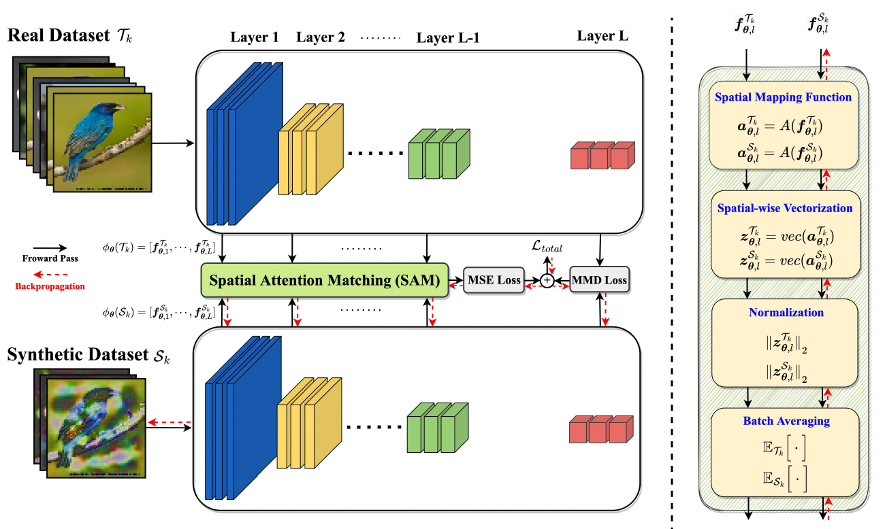
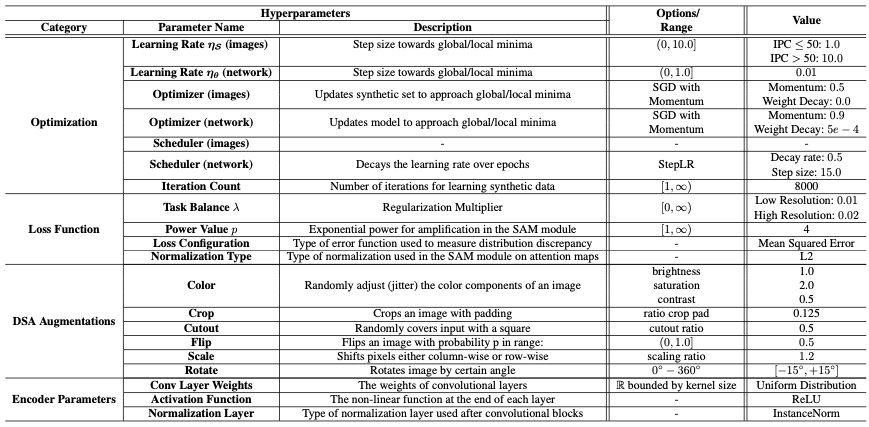

# DataDAM: Efficient Dataset Distillation with Attention Matching
Official implementation of "DataDAM: Efficient Dataset Distillation with Attention Matching", published as a conference paper at ICCV 2023.
- Project Page: https://datadistillation.github.io/DataDAM/
## Abstract
Researchers have long tried to minimize training costs in deep learning while maintaining strong generalization across diverse datasets. Emerging research on dataset distillation aims to reduce training costs by creating a small synthetic set that contains the information of a larger real dataset and ultimately achieves test accuracy equivalent to a model trained on the whole dataset. Unfortunately, the synthetic data generated by previous methods are not guaranteed to distribute and discriminate as well as the original training data, and they incur significant computational costs. Despite promising results, there still exists a significant performance gap between models trained on condensed synthetic sets and those trained on the whole dataset. In this paper, we address these challenges using efficient Dataset Distillation with Attention Matching (DataDAM), achieving state-of-the-art performance while reducing training costs. Specifically, we learn synthetic images by matching the spatial attention maps of real and synthetic data generated by different layers within a family of randomly initialized neural networks. Our method outperforms the prior methods on several datasets, including MNIST, CIFAR10/100, TinyImageNet, and ImageNet-1K, across most of the settings, and achieves improvements of up to 6.5\% and 4.1\% on CIFAR100 and ImageNet-1K, respectively. We also show that our high-quality distilled images have practical benefits for downstream applications, such as continual learning and neural architecture search.
<p align="center">

</p>

## File Tree
This folder contains all neccesary code files and supplemental material for the main paper.
```
.
├── main_DataDAM.py         # Source Code for reproducing DataDAM results on behncmark datasets and IPCs
├── networks.py             # Defines all relevant network architectures, including cross-arch models
├── utils.py                # Defines all utility functions required for any task or ablation in main paper, inlcuding our attention module
├── distill_test_model.py   # Script to test the frozen models
├── requirements.txt        # Lists all related Python packages neccessary for reproducing our model results
├── Supplementary.pdf       # Supplementary pdf for our main paper -- DataDAM
└── README.md
```


## HyperParameter Table
For reproducibility, we outline our associated hyperparameters below:
<p align="center">

</p>

## Distilled Datasets & Frozen Evaluation Models

We provide saved tensors of the dataset and frozen evaluation models trained on the respective distilled dataset on our HuggingFace Page: https://huggingface.co/datasets/uoft-dsp-lab/DataDAM

Additionally these frozen models can be tested with "distill_test_model.py"
